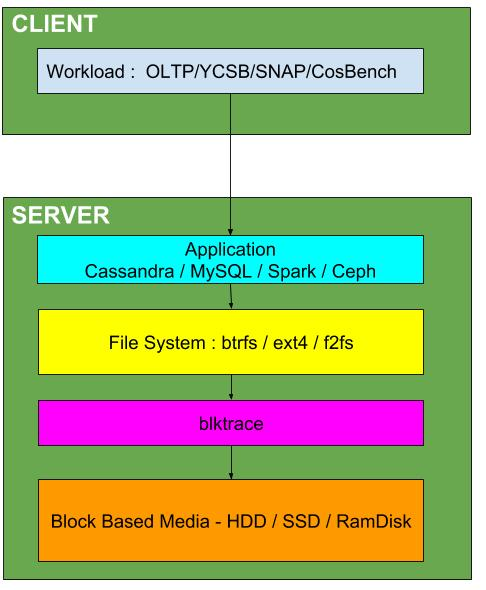

# CSC2233 - Project 1 - Mitigating Blktrace Overheads

**Pre-requisites**

- Sound knowledge of blktrace/blkparse tool
- creating, formatting, and mounting file systems
- linux utilities (cut, grep, sed)
- large data processing (few GBs) using numpy/python/shell scripting
- installing and setting up workloads like YCSB, TPCC
- installing and setting up applications like Spark, Cassandra, MySQL

# Objective

This project evaluates the overheads of blktrace while running workloads on applications. The goal is to first identify for what workloads the performance of the application reduces when blktrace is enabled. The next part of the project will explore ways to reduce the blocktrace overheads.
The figure below show how the storage stack is aligned.

# Checkpoint 1 Mid Term Checkpoint (Feb 28th)
- Choose one or more applications for your system:
1. dd
2. fio
3. filebench (mail server, web server and file server)
- For these applications, you do not need workloads - which means you do not need a client machine. The workload can be configured using different command line parameters in the application. We will call the above applications *microbenchmarks*.
- Run one or more microbenchmarks using different options on ext4, btrfs and f2fs file systems. Each of the microbenchmarks should run for the file system on HDD and SSD and if possible, and in-memory block device [ramdisk](https://www.jamescoyle.net/how-to/943-create-a-ram-disk-in-linux). Ensure that you are writing large amount of data to your disk so that disk is being stressed. One way to do this would be to use multiple threads for dd, fio and filebench. The goal is to utilize full bandwidth of the HDD or SSD.
- Run each of the microbenchmarks again,  but this time, enable blktrace.
- Quantify the overhead - does it take more time to complete a specific workload (fio)? does it cause drop in performance (time to complete a dd operation or IOPS/Bandwidth for fio)? Draw graphs to show the relative performance for one or more microbenchmark configurations.
- Explore the following workloads and applications. Finalize one workload and one application pair, and complete installation for both and get instructors approval.
1. [OLTP](https://github.com/oltpbenchmark/oltpbench) + MySQL
2. [YCSB](https://github.com/brianfrankcooper/YCSB/wiki) + [Cassandra](https://github.com/apache/cassandra)
3. [Stanford Large Network Data set Collection](https://snap.stanford.edu/data/) + [Spark](https://github.com/apache/spark)
4. [COSBench](https://github.com/intel-cloud/cosbench) + [Ceph](https://ceph.com/)

# Checkpoint 2 End Term Checkpoint (March 31st)
- Identify the workload configurations that has a high blktrace overhead for the application you choose above.
- Characterize the workload - draw frequency distribution graph (based on block numbers, or sizes of block requested) that you record in the blocktrace output.
- Identify ways to reduce this overhead. some ideas:
1. can we reduce the granularity at which blktrace logs blocks - e.g. coalesce multiple log messages into a single log? This way the size of the blktrace log can be reduced considerably.
2. redirect logging of the messages in [ramdisk](https://www.jamescoyle.net/how-to/943-create-a-ram-disk-in-linux) for a short period of time, after which flush the log messages permanently to disk.

# Checkpoint 3 Final Report
- You should submit 2 reports

## Main Report (Latex + pdf)
1. A pdf document describing your application, different workload configurations explored, blktrace overheads observed in each configuration, and steps taken to reduce this overhead.

## Setup Instructions (Latex + pdf / markdown) and Code
2. A zip file of a document describing your application, setup instructions so that another student can repeat your experiments and recreate your results, a link to your blktrace files. all blocktrace analysis code/scripts - documented and commented - with your name.
