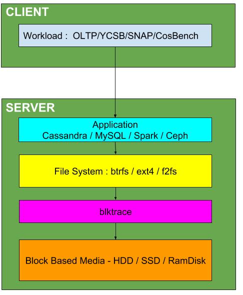

# CSC2233 - Project 4 - Workload Analysis with SSDs in Mind

# Pre-requisites

- Sound knowledge of blktrace/blkparse tool
- creating, formatting, and mounting file systems
- installing and setting up workloads like YCSB, TPCC
- installing and setting up applications like Spark, Cassandra, MySQL

# Objective

This project has two parts. The first part involves choosing a workload and an application and collecting blocktrace. The second and most important part is to define new metrics for characterising a blocktrace workload. This project should draw ideas from blocktrace analysis papers like the [streetlight paper](https://www.usenix.org/system/files/conference/hotstorage16/hotstorage16_yadgar.pdf) and [Multi-Dimentional Trace Analyisis paper](http://delivery.acm.org/10.1145/2050000/2043562/p43-chen.pdf?ip=128.100.3.15&id=2043562&acc=ACTIVE%20SERVICE&key=FD0067F557510FFB%2E148C9AE997532579%2E4D4702B0C3E38B35%2E4D4702B0C3E38B35&__acm__=1549578522_01854db7500e462cfc191a95e2a9aec7).

The figure below show how the storage stack is aligned.
#

# Checkpoint 1 Mid Term Checkpoint (Mid-Feb)

Choose and run one of the following workload and application and collect blocktrace for ext4, btrfs and f2fs file systems:

- Cassandra + YCSB
- OLTP + MySQL
- Stanford Large Network Data Set Collection + Spark

- Run the applications and workloads for ext4, btrfs and F2FS file systems and collect blocktraces.
- Read and understand "Avoiding the streetlight effect" paper and apply the metrics used in the paper to the traces you collected.

# Checkpoint 2 End Term Checkpoint (End of March)

- Define and apply new metrics to your workload that can help us configure or design SSD.
- Define and apply new metrics to your workload that can help us configure or design caches.

# Final Report

- A pdf document describing application of existing metrics, definition of new metrics and how they can help design storage systems.

# Additional Readings

- [CounterStacks Paper](https://www.usenix.org/node/186182).
- [Shards paper](https://www.usenix.org/system/files/conference/fast15/fast15-paper-waldspurger.pdf).
